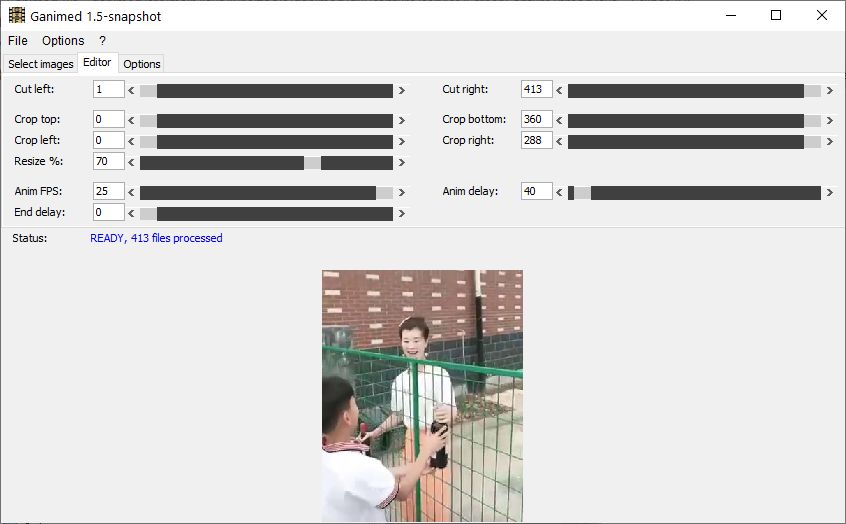

Ganimed - a GIF animation editor
==
*Don´t trust the name, it´s a creator not yet an editor.*

Ganimed is a tool to create an **animated GIF** or an **animated PNG**

- either from **images captured from screen**
- or from a **series of single image files** (i.e. extracted from a video or a bunch of stop-motion photos)

__Features:__

* capture a desired movie-sequence directly from your screen/video player
* easy cut, crop and resize images and adjust framerate
* instant feedback in GUI
* extra delay for last image

For more infos please visit [Ganimed wiki](https://github.com/Moon70/Ganimed/wiki).

  

